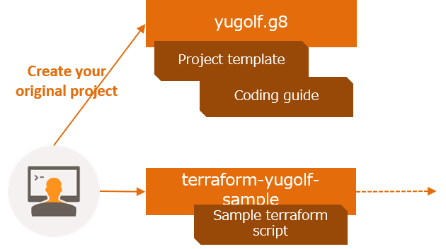
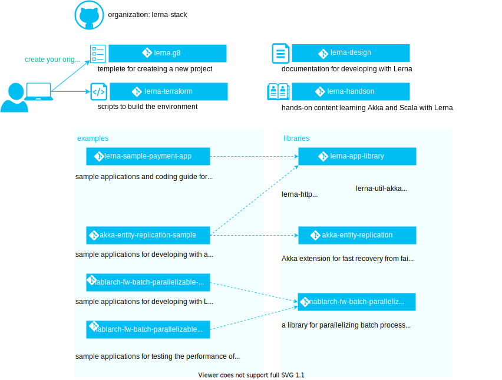

- Using the Hello World guide, you’ll start a branch, write comments, and open a pull request.
- Using the Hello World guide, you’ll start a branch.
- Using the Hello World guide, you’ll start a branch, write comments, and open a pull request, you’ll start a branch, you’ll start a branch.

## Concept

### abc

- 外部設計[^1] が確認できる状況であること
aa

[^1] : 本書では「外部システム・サブシステム・ユーザーとインターフェイスを合意するための設計」とみなしています。例えば、HTTP API の仕様や、画面定義、共通利用する（RDBMSの）テーブル定義などが含まれると想定しています。

# bbbbb
- 000
- 1111

エンティティ[^3](#3)があるとします。外部システムに委譲した決済処理が成功した場合、そのイベントは「決済成功」と命名するよりも「決済成功確認」と命名するほうが望ましいです。
aaa

注釈のようなことを実現可能です[1](#note1)

## cccc
- 22
- 33
- 3:状態変更のライフサイクルを管理する必要があるものをエンティティと呼びます

# DDD

| Name  | Description |
| ----------- | ---- |
| Reference Code  | Coming soon. |
| Project Template | Coming soon. |
| Terraform Script | Coming soon. |
| Guides | Coming soon. |
| Learning Content | Coming soon. |

[akka](https://akka.io/)

  

  

 <object type="image/svg+xml"  data="img/lerna_content_map_en.svg"></object>

<svg xmlns="http://www.w3.org/2000/svg" xmlns:xlink="http://www.w3.org/1999/xlink" version="1.1" width="852px" height="645px" viewBox="-0.5 -0.5 852 645" content="&lt;mxfile&gt;&lt;diagram id=&quot;Sa7jewannrHOQG42tZp-&quot; name=&quot;Page-1&quot;&gt;7V1bk9o4Fv41PEL5Djx2d5rZ2srMpirZnZmnLmEL8GAsRhYN3b9+j2zJV9mAwQQYkkoaCVm29H3noqNjdc98We1+oWi9+JV4OOgZmrfrmV96hjEyR/A/r/gQFZqRVMyp7yVVelbx3f/EolITtRvfw1GhISMkYP66WOmSMMQuK9QhSsm22GxGguJd12iOKxXfXRRUa3/3PbYQozCGWf2/sD9fyDvrzjj5ZoVkYzGSaIE8ss1Vma8984USwpJPq90LDvjcyXlJrpvUfJs+GMUhO+QC9/PZHFq//+/L8Nvnn0Z/+e/h1x99UzzcOwo2YsQ9wwmgw+dojUL4POef4SdareFDOI34j8CfUkR9AEY0htsW28cjZh9yGrcLn+Hva+Ty8haYAo0WbBVASYePlGxCD/MH1fid5UzxwjxAUSS/WGLmLuQXFHk+jP2FBIRCXUhC6PwZBf48hGKAZ/xJPBQt4o75bd4xZT5g+yTaMMKfY+YHgeykZ5gTY/I6mfC7MUqWuNT9jGR3hMaa9vw6MdIR8xvgXS1Aego7iAsmK8zoBzQRF9gSDCEqpixvM+IZY1G3yJHOkhRDguzztO+MD/BBUOIIehi2ih4FKuAdFAPOhBuCPEBTHDwjdzmPH6OM8ZUQQh/tJ4RpdEUIQwF9CWI5uV/5dH4jkc98wid5ShgjqyLeaiAkdC5MCaa1c1wEJJ1jYM2aP8pqN+fGZ4A+NxQPNlHc0zkk0irMv2FX598aDuwqAHZXAmnaFRCwBwZLFMV8FWWLULYgcxICToRPegzHX5ixD2Fu0YaRIlh457M/+OWDsSGKf8ZFW5S+7ETnceEjV/iGqQ9j5RDEdSX5MM3xWCFMVcnhw2qGDWaBbKgrWpnCOUB0jlnDDA4tNeQUB4j578V7noKfeavyE6B10vma+LzX13foPBKPcQapGu+XKluh1MzjZeq/oAn+M/2L+4WGFuv85NIA0xAN5sI1DfxwmdQvGONu5RPvz5jMfbbYTAcuIGFM4kv6EQObIUtpB+sAjNwCPEtMi96mpIKdmw/BksMNZUmAZvGfY5E+A2yGdOU/pHWyB9I/yHso2nmwg2IOvmNUZFXOzqYP9WOUYQgD/CNfyF3Fi9llcUleV3BfmrWnXJHEjxXK1ZPVgXZ1DtSuutONdm2U5H4Uu6D9NfpYwSD6aL0+TbJrO5TEy4/yaIE+SnBLBJjEf84k0FrJvXQU6w39ctI8VhjMZHW5CXIL0bgm8GUNwxwqhuPFPeWRAIoRw344508I/0K85dNCScKedL2adZGrzN+p+/XMXiaoFzjnwF4vKnNDtwYKXW4p0Je64BTfSK8POzRhnYglv/d6HYAzxN2liBdDLw4BeQnqccwo5YOH33FA1slXW5B8+PGVS/mDC9KQl/TAWKEHrFGVCdaZPbI+OJsUAWqrE9V3qZ+Udfl5uF21bRXhUvnPl3TCdFWg4ABZdqm/Zlx6wdkytOnGD7gQswWXXBy++5SE3PjKK6dUIaL/aLmt6PCh05n9bpZbD0d8cKcJbb6TRgc/Idyti7FtjQvo6SOlBe5OkJshXYBNjcipmBZ6aQbVukdQL6ybmyEFp6mfbNx8nAhrpadmaDtYLdVA2GH4w3YOWC1dHlq0XKI+DMFnH32KU6+4NcCN/TXDPLoLCS7BbMlo5VWFuIYVz6bLXYBLRL3qAl2FaNilo15qngsVvzcWVse0rmJh5Z1ZHvtA0wBRd9GfbftTBE5rH0aMggAH/id8hfti97a1ujjuBs36Y3wP+qMcVLOHCv1xwaCaWn+YV6s/rjL6rRZv7UA9UDCMXe44qrG2rhZrta3Q91iKe2TIhXdNapy8fnSaMTik2+Z0I613hyZA6UJ2ZwKOcA8OqNpn4DvzHA6hy13Ec227GDNwtOEVrjhGN2ZFtMHwJjfa1UQ3bmfJcawC6a8x5Vs1KHQxwxHrfknSeMNmhXMXkeeyfXLsK7FP7QDfj1pzaPk6k/CS8b65xOPXqjLx2mxWnYE95d1iXa/GQVXpey1SYttbq/pUEp4RsqB4Ftc6f2/42xfPh1JNtpf7i4TOUQhaJWHME6dvobnckUTXuCF5Dk1SemNBV+QD6ioydPbCgmXUIt+0Ge0Rd8M3m0Ws+5E50u6NlZosomFHWURqBqjyrvczIN6p7Mfgu2B648QDkGZEwwT+J1jb9mSmEX8/DD04cRgnRlX7YA4V70x0xwirFSPqks3qdcNZbEz9DlzZ+tQ3VNidBzlVzottVMmpTnWzuiKn8g27qyXn/qhNmaVCOWpx6wQs2V4Y2zSToJ63j+SvvUweK6JGKiZ39mqa5XTAZL5AT2icJAbm1u5QIrN/CLGzmuIEgNon9JHUXiMTjiKR2VRFUruTiWErmRDOJt6BHxrlVyQzFLEYdpfATPGhzygnM3zhBxuKM3WfOgSx8ADLGZ7xW2qJw8CFh3e72vCjFGL5Cwk/aAEGxOtfgk3EYxkP/Xugm2sbiiDaZfXvqBXXUF5RCZplqiyhT6riKHFxFLX1K6SOFcGtgU+gEpbewLrJ16cfr99/JGWuKDNj8DajaIW3hC4b6sUTTnyg0G4Qs6qisH8Tt4cHfRYDmmRdPJyP9uR3zJ/ufLR7eew8voMiKXYyDciUjwRxdSpILXKiodvByqvyM/v6rB7DzxhjQOYNQ4Rvb36E4IGhOeYxw4aBZo0ax3bYMv3njpc74ku/abCixc2PdMP8oGGY/Ou7sRYl09DNLkHlXCOFW647VtVa6FpX5kLaoRswF5xvfR7q28PJuM3Nq9V4JBH+e4NhgbtvxLLdzY8aaOh7sVPbMOSs0c2Pd4so67uENiGctrkbZXsR19yxnXbKdtSVrnVUW7IlCC6Vg1Gba/HGI2lwWwIDbgd5+dC4cybsjNNtVbnRrkJVeRJZVnuWdC+jd4k3fIdmbj5uJWMHWp+YqlNISGw+orBIvfIRhMPzJafq1kDuLKQvKhuDYXWX31TEVc3jqdfrPmGsdHpXMxObc8fIhsH9gTfy8FkFHPB3wjuoO71SSb2UClqOw7V8P5DkpUPFRBarLtMNZTIvvyWK1smAZv6OP4eS1hU52EbWID6PBzF8OO2PYXqHx5tpzuDAE86ctLZAdr2Fpr0Y3Y94FX/Y/CJeDRMybAvc3Zf/GpQ4nZK1JemVEllV9yXmktnMh/WGS2A1sWbRAHkexVH0NiVkWSFyW+7WaOku31kHTo/1AqehTpGiZY4GmlOltDE+D6UPcxRHesVRTM7y4k9PNnxjglB/7oco6OUO9Lpab77Dk4FLR2jqijeMxgo8W9jjjrRRzQlNan3UfH7EdXqDyfFGb3fpFBpa0SNUnnIyUq1GLvnK0qi6zHwclZygkFTtPyr51NdSxaXfOPsz+ujlA8ycklpKnlVclRGj0hFMROqJ1fWVDLLSV0yydEjtgxsjVdLTI7hxjDIZlpWJo3BQzhjcOBBYVebOA9hjnM+xWYlaGar11OWxVWXKPLA9BttR6ehB27kOZFVpIA9kjzpU0hzoZgFc07kOcMeqTdsHuEc57lY5xmVr2nWA+9glOv217pK9tRUHwl4eWNXbVw9gT5Na1Sv7l0f2sfY5u4t8Nbb2sfw52UUuvSBwLYb2sfg5+YhYoyS1DjjN3WILxew3hSbBq+zXrZqv/wc=&lt;/diagram&gt;&lt;/mxfile&gt;"><defs/><g><rect x="476" y="220" width="290" height="420" fill="#f2feff" stroke="none" pointer-events="all"/><g transform="translate(-0.5 -0.5)"><switch><foreignObject style="overflow: visible; text-align: left;" pointer-events="none" width="100%" height="100%" requiredFeatures="http://www.w3.org/TR/SVG11/feature#Extensibility">

 libraries

</foreignObject><text x="478" y="239" fill="#00BEF2" font-family="Helvetica" font-size="12px"> libraries</text></switch></g><rect x="126" y="220" width="320" height="420" fill="#f2feff" stroke="none" pointer-events="all"/><g transform="translate(-0.5 -0.5)"><switch><foreignObject style="overflow: visible; text-align: left;" pointer-events="none" width="100%" height="100%" requiredFeatures="http://www.w3.org/TR/SVG11/feature#Extensibility">

 examples

</foreignObject><text x="128" y="239" fill="#00BEF2" font-family="Helvetica" font-size="12px"> examples</text></switch></g><path d="M 13.58 154.39 C 13.51 150.61 14.78 146.96 17.11 144.25 C 19.44 141.55 22.63 140.01 25.96 140 C 33.4 140.08 39.47 146.48 39.74 154.54 C 40.02 158.24 38.9 161.91 36.63 164.69 C 34.37 167.46 31.16 169.1 27.75 169.23 C 20.22 169.39 13.94 162.81 13.58 154.39 Z M 0 190 C 0.3 182.97 2.91 176.42 7.21 171.94 C 10.62 168.56 15.37 168.36 18.95 171.44 C 21 172.95 23.24 174.17 25.62 175.06 C 28.06 176.12 30.74 175.94 33.08 174.56 C 34.36 173.94 35.5 173.04 36.41 171.94 C 37.31 170.86 38.88 170.64 40.04 171.44 C 42.09 172.81 43.92 175.24 45.36 178.48 C 46.75 182.16 47.48 186.05 47.5 189.99 Z" fill="#00bef2" stroke="none" pointer-events="all"/><path d="M 86 155 L 147.42 105.56" fill="none" stroke="#00bef2" stroke-miterlimit="10" pointer-events="stroke"/><path d="M 151.51 102.27 L 148.25 109.38 L 147.42 105.56 L 143.86 103.93 Z" fill="#00bef2" stroke="#00bef2" stroke-miterlimit="10" pointer-events="all"/><rect x="40" y="140" width="50" height="30" fill="none" stroke="none" pointer-events="all"/><path d="M 44.24 163.27 L 44.24 141.35 C 44.55 140.62 45.21 140.11 45.99 140 L 83.86 140 C 84.82 140.11 85.6 140.81 85.81 141.74 L 85.81 163.27 L 89.82 167.61 C 90 168.15 89.83 168.71 89.35 169.16 C 88.88 169.62 88.14 169.92 87.32 170 L 42.73 170 C 41.9 169.93 41.15 169.63 40.66 169.18 C 40.18 168.72 40 168.15 40.18 167.61 Z M 45.89 163.27 L 84.31 163.32 L 84.31 142.19 C 84.13 141.66 83.66 141.28 83.1 141.2 L 46.9 141.2 C 46.35 141.38 45.96 141.87 45.89 142.44 Z M 61.14 166.21 L 59.78 168.16 L 69.21 168.16 L 68.16 166.21 Z" fill="#00bef2" stroke="none" pointer-events="all"/><a xlink:href="https://github.com/lerna-stack/lerna.g8"><rect x="184" y="75.25" width="200" height="30" fill="#00bef2" stroke="none" pointer-events="all"/><g transform="translate(-0.5 -0.5)"><switch><foreignObject style="overflow: visible; text-align: left;" pointer-events="none" width="100%" height="100%" requiredFeatures="http://www.w3.org/TR/SVG11/feature#Extensibility">

lerna.g8

</foreignObject><text x="284" y="94" fill="#ffffff" font-family="Helvetica" font-size="12px" text-anchor="middle">lerna.g8</text></switch></g></a><path d="M 356 265 L 501.13 265" fill="none" stroke="#00bef2" stroke-miterlimit="10" stroke-dasharray="3 3" pointer-events="stroke"/><path d="M 504.88 265 L 499.88 267.5 L 501.13 265 L 499.88 262.5 Z" fill="#00bef2" stroke="#00bef2" stroke-miterlimit="10" pointer-events="all"/><a xlink:href="https://github.com/lerna-stack/lerna-sample-payment-app"><rect x="146" y="250" width="210" height="30" fill="#00bef2" stroke="none" pointer-events="all"/><g transform="translate(-0.5 -0.5)"><switch><foreignObject style="overflow: visible; text-align: left;" pointer-events="none" width="100%" height="100%" requiredFeatures="http://www.w3.org/TR/SVG11/feature#Extensibility">

lerna-sample-payment-app

</foreignObject><text x="251" y="269" fill="#FFFFFF" font-family="Helvetica" font-size="12px" text-anchor="middle">lerna-sample-payment-app</text></switch></g></a><rect x="164" y="104.5" width="240" height="26" fill="none" stroke="none" pointer-events="all"/><g transform="translate(-0.5 -0.5)"><switch><foreignObject style="overflow: visible; text-align: left;" pointer-events="none" width="100%" height="100%" requiredFeatures="http://www.w3.org/TR/SVG11/feature#Extensibility">

<ul><li>templete for createing a new project</li></ul>

</foreignObject><text x="166" y="121" fill="#000000" font-family="Helvetica" font-size="12px">templete for createing a new project</text></switch></g><rect x="126" y="280" width="248" height="40" fill="none" stroke="none" pointer-events="all"/><g transform="translate(-0.5 -0.5)"><switch><foreignObject style="overflow: visible; text-align: left;" pointer-events="none" width="100%" height="100%" requiredFeatures="http://www.w3.org/TR/SVG11/feature#Extensibility">

<ul><li>sample applications and coding guide for developing with Lerna</li></ul>

</foreignObject><text x="128" y="304" fill="#000000" font-family="Helvetica" font-size="12px">sample applications and coding guide for...</text></switch></g><a xlink:href="https://github.com/lerna-stack/lerna-terraform"><rect x="186" y="140" width="200" height="30" fill="#00bef2" stroke="none" pointer-events="all"/><g transform="translate(-0.5 -0.5)"><switch><foreignObject style="overflow: visible; text-align: left;" pointer-events="none" width="100%" height="100%" requiredFeatures="http://www.w3.org/TR/SVG11/feature#Extensibility">

lerna-terraform

</foreignObject><text x="286" y="159" fill="#FFFFFF" font-family="Helvetica" font-size="12px" text-anchor="middle">lerna-terraform</text></switch></g></a><rect x="164" y="166" width="210" height="30" fill="none" stroke="none" pointer-events="all"/><g transform="translate(-0.5 -0.5)"><switch><foreignObject style="overflow: visible; text-align: left;" pointer-events="none" width="100%" height="100%" requiredFeatures="http://www.w3.org/TR/SVG11/feature#Extensibility">

<ul><li>scripts to build the environment </li></ul>

</foreignObject><text x="166" y="185" fill="#000000" font-family="Helvetica" font-size="12px">scripts to build the environment&#xa;</text></switch></g><a xlink:href="https://github.com/lerna-stack/lerna-design"><rect x="495" y="74.5" width="200" height="30" fill="#00bef2" stroke="none" pointer-events="all"/><g transform="translate(-0.5 -0.5)"><switch><foreignObject style="overflow: visible; text-align: left;" pointer-events="none" width="100%" height="100%" requiredFeatures="http://www.w3.org/TR/SVG11/feature#Extensibility">

lerna-design

</foreignObject><text x="595" y="93" fill="#FFFFFF" font-family="Helvetica" font-size="12px" text-anchor="middle">lerna-design</text></switch></g></a><a xlink:href="https://github.com/lerna-stack/lerna-handson"><rect x="495" y="140" width="200" height="30" fill="#00bef2" stroke="none" pointer-events="all"/><g transform="translate(-0.5 -0.5)"><switch><foreignObject style="overflow: visible; text-align: left;" pointer-events="none" width="100%" height="100%" requiredFeatures="http://www.w3.org/TR/SVG11/feature#Extensibility">

lerna-handson

</foreignObject><text x="595" y="159" fill="#FFFFFF" font-family="Helvetica" font-size="12px" text-anchor="middle">lerna-handson</text></switch></g></a><a xlink:href="https://github.com/lerna-stack/lerna-app-library"><rect x="506" y="250" width="200" height="30" fill="#00bef2" stroke="none" pointer-events="all"/><g transform="translate(-0.5 -0.5)"><switch><foreignObject style="overflow: visible; text-align: left;" pointer-events="none" width="100%" height="100%" requiredFeatures="http://www.w3.org/TR/SVG11/feature#Extensibility">

lerna-app-library

</foreignObject><text x="606" y="269" fill="#FFFFFF" font-family="Helvetica" font-size="12px" text-anchor="middle">lerna-app-library</text></switch></g></a><a xlink:href="https://github.com/lerna-stack/akka-entity-replication"><rect x="506" y="384" width="200" height="30" fill="#00bef2" stroke="none" pointer-events="all"/><g transform="translate(-0.5 -0.5)"><switch><foreignObject style="overflow: visible; text-align: left;" pointer-events="none" width="100%" height="100%" requiredFeatures="http://www.w3.org/TR/SVG11/feature#Extensibility">

akka-entity-replication

</foreignObject><text x="606" y="403" fill="#FFFFFF" font-family="Helvetica" font-size="12px" text-anchor="middle">akka-entity-replication</text></switch></g></a><path d="M 356 479 L 500.25 510.95" fill="none" stroke="#00bef2" stroke-miterlimit="10" stroke-dasharray="3 3" pointer-events="stroke"/><path d="M 503.91 511.76 L 498.49 513.12 L 500.25 510.95 L 499.57 508.24 Z" fill="#00bef2" stroke="#00bef2" stroke-miterlimit="10" pointer-events="all"/><a xlink:href="https://github.com/lerna-stack/nablarch-fw-batch-parallelizable-example"><rect x="146" y="464" width="210" height="30" fill="#00bef2" stroke="none" pointer-events="all"/><g transform="translate(-0.5 -0.5)"><switch><foreignObject style="overflow: visible; text-align: left;" pointer-events="none" width="100%" height="100%" requiredFeatures="http://www.w3.org/TR/SVG11/feature#Extensibility">

  nablarch-fw-batch-parallelizable-example

</foreignObject><text x="251" y="483" fill="#FFFFFF" font-family="Helvetica" font-size="12px" text-anchor="middle">nablarch-fw-batch-parallelizable-...</text></switch></g></a><path d="M 356 399 L 501.13 399" fill="none" stroke="#00bef2" stroke-miterlimit="10" stroke-dasharray="3 3" pointer-events="stroke"/><path d="M 504.88 399 L 499.88 401.5 L 501.13 399 L 499.88 396.5 Z" fill="#00bef2" stroke="#00bef2" stroke-miterlimit="10" pointer-events="all"/><path d="M 356 399 L 502.19 283.03" fill="none" stroke="#00bef2" stroke-miterlimit="10" stroke-dasharray="3 3" pointer-events="stroke"/><path d="M 505.12 280.69 L 502.76 285.76 L 502.19 283.03 L 499.65 281.84 Z" fill="#00bef2" stroke="#00bef2" stroke-miterlimit="10" pointer-events="all"/><a xlink:href="https://github.com/lerna-stack/akka-entity-replication-sample"><rect x="146" y="384" width="210" height="30" fill="#00bef2" stroke="none" pointer-events="all"/><g transform="translate(-0.5 -0.5)"><switch><foreignObject style="overflow: visible; text-align: left;" pointer-events="none" width="100%" height="100%" requiredFeatures="http://www.w3.org/TR/SVG11/feature#Extensibility">

akka-entity-replication-sample

</foreignObject><text x="251" y="403" fill="#FFFFFF" font-family="Helvetica" font-size="12px" text-anchor="middle">akka-entity-replication-sample</text></switch></g></a><a xlink:href="https://github.com/lerna-stack/nablarch-fw-batch-parallelizable"><rect x="505" y="497" width="200" height="30" fill="#00bef2" stroke="none" pointer-events="all"/><g transform="translate(-0.5 -0.5)"><switch><foreignObject style="overflow: visible; text-align: left;" pointer-events="none" width="100%" height="100%" requiredFeatures="http://www.w3.org/TR/SVG11/feature#Extensibility">

     nablarch-fw-batch-parallelizable

</foreignObject><text x="605" y="516" fill="#FFFFFF" font-family="Helvetica" font-size="12px" text-anchor="middle">nablarch-fw-batch-paralleliz...</text></switch></g></a><path d="M 356 559 L 500.29 520.75" fill="none" stroke="#00bef2" stroke-miterlimit="10" stroke-dasharray="3 3" pointer-events="stroke"/><path d="M 503.92 519.79 L 499.73 523.48 L 500.29 520.75 L 498.45 518.65 Z" fill="#00bef2" stroke="#00bef2" stroke-miterlimit="10" pointer-events="all"/><a xlink:href="https://github.com/lerna-stack/nablarch-fw-batch-parallelizable-performancetest-example"><rect x="146" y="544" width="210" height="30" fill="#00bef2" stroke="none" pointer-events="all"/><g transform="translate(-0.5 -0.5)"><switch><foreignObject style="overflow: visible; text-align: left;" pointer-events="none" width="100%" height="100%" requiredFeatures="http://www.w3.org/TR/SVG11/feature#Extensibility">

   nablarch-fw-batch-parallelizable-performancetest-example

</foreignObject><text x="251" y="563" fill="#FFFFFF" font-family="Helvetica" font-size="12px" text-anchor="middle">nablarch-fw-batch-parallelizable...</text></switch></g></a><a xlink:href="https://github.com/lerna-stack"><rect x="126" y="0" width="50" height="50" fill="none" stroke="none" pointer-events="all"/><path d="M 126 25 C 126 11.19 137.19 0 151 0 C 164.81 0 176 11.19 176 25 C 176 38.81 164.81 50 151 50 C 137.19 50 126 38.81 126 25 Z M 128.4 25 C 128.34 35.01 134.9 43.85 144.5 46.7 L 144.5 42.35 C 144.59 40.79 145.41 39.37 146.7 38.5 C 142.9 38.08 139.47 36.4 137.22 33.85 C 134.98 31.3 134.1 28.1 134.8 25 C 135.16 22.85 136.07 20.84 137.45 19.15 C 136.6 16.98 136.67 14.56 137.65 12.45 C 140.18 12.55 142.6 13.52 144.5 15.2 C 148.71 13.74 153.28 13.72 157.5 15.15 C 159.43 13.47 161.89 12.51 164.45 12.45 C 165.44 14.65 165.52 17.15 164.65 19.4 C 165.95 21.03 166.83 22.95 167.2 25 C 167.9 28.09 167.03 31.28 164.79 33.83 C 162.55 36.38 159.14 38.07 155.35 38.5 C 156.57 39.28 157.39 40.56 157.6 42 L 157.6 46.8 C 167.21 43.92 173.76 35.03 173.65 25 C 173.65 19.01 171.26 13.26 167.01 9.04 C 162.75 4.81 156.99 2.46 151 2.5 C 145.02 2.47 139.27 4.83 135.03 9.05 C 130.78 13.28 128.4 19.02 128.4 25 Z" fill="#00bef2" stroke="none" pointer-events="all"/></a><rect x="176" y="15" width="150" height="20" fill="none" stroke="none" pointer-events="all"/><g transform="translate(-0.5 -0.5)"><switch><foreignObject style="overflow: visible; text-align: left;" pointer-events="none" width="100%" height="100%" requiredFeatures="http://www.w3.org/TR/SVG11/feature#Extensibility">

<a href="https://github.com/lerna-stack">organization: lerna-stack</a>

</foreignObject><text x="251" y="29" fill="#000000" font-family="Helvetica" font-size="12px" text-anchor="middle">organization: lerna-stack</text></switch></g><rect x="476" y="104.5" width="270" height="26" fill="none" stroke="none" pointer-events="all"/><g transform="translate(-0.5 -0.5)"><switch><foreignObject style="overflow: visible; text-align: left;" pointer-events="none" width="100%" height="100%" requiredFeatures="http://www.w3.org/TR/SVG11/feature#Extensibility">

<ul><li>documentation for developing with Lerna</li></ul>

</foreignObject><text x="478" y="121" fill="#000000" font-family="Helvetica" font-size="12px">documentation for developing with Lerna</text></switch></g><rect x="476" y="170" width="375" height="26" fill="none" stroke="none" pointer-events="all"/><g transform="translate(-0.5 -0.5)"><switch><foreignObject style="overflow: visible; text-align: left;" pointer-events="none" width="100%" height="100%" requiredFeatures="http://www.w3.org/TR/SVG11/feature#Extensibility">

<ul><li>hands-on content learning Akka and Scala with Lerna</li></ul>

</foreignObject><text x="478" y="187" fill="#000000" font-family="Helvetica" font-size="12px">hands-on content learning Akka and Scala with Lerna</text></switch></g><rect x="126" y="410" width="248" height="44" fill="none" stroke="none" pointer-events="all"/><g transform="translate(-0.5 -0.5)"><switch><foreignObject style="overflow: visible; text-align: left;" pointer-events="none" width="100%" height="100%" requiredFeatures="http://www.w3.org/TR/SVG11/feature#Extensibility">

<ul><li>sample applications for developing with <a href="https://github.com/lerna-stack/akka-entity-replication">akka-entity-replication</a></li></ul>

</foreignObject><text x="128" y="436" fill="#000000" font-family="Helvetica" font-size="12px">sample applications for developing with a...</text></switch></g><rect x="126" y="487" width="248" height="50" fill="none" stroke="none" pointer-events="all"/><g transform="translate(-0.5 -0.5)"><switch><foreignObject style="overflow: visible; text-align: left;" pointer-events="none" width="100%" height="100%" requiredFeatures="http://www.w3.org/TR/SVG11/feature#Extensibility">

<ul><li>sample applications for developing with <a href="https://github.com/lerna-stack/nablarch-fw-batch-parallelizable">Lerna batch parallelization library</a> </li></ul>

</foreignObject><text x="128" y="516" fill="#000000" font-family="Helvetica" font-size="12px">sample applications for developing with L...</text></switch></g><rect x="126" y="580" width="300" height="50" fill="none" stroke="none" pointer-events="all"/><g transform="translate(-0.5 -0.5)"><switch><foreignObject style="overflow: visible; text-align: left;" pointer-events="none" width="100%" height="100%" requiredFeatures="http://www.w3.org/TR/SVG11/feature#Extensibility">

<ul><li>sample applications for testing the performance of <a href="https://github.com/lerna-stack/nablarch-fw-batch-parallelizable">Lerna batch parallelization library</a> </li><li>performance report</li></ul>

</foreignObject><text x="128" y="609" fill="#000000" font-family="Helvetica" font-size="12px">sample applications for testing the performance of...</text></switch></g><rect x="476" y="414" width="248" height="50" fill="none" stroke="none" pointer-events="all"/><g transform="translate(-0.5 -0.5)"><switch><foreignObject style="overflow: visible; text-align: left;" pointer-events="none" width="100%" height="100%" requiredFeatures="http://www.w3.org/TR/SVG11/feature#Extensibility">

<ul><li>Akka extension for fast recovery from failure with replicating stateful entity on multiple nodes in Cluster </li></ul>

</foreignObject><text x="478" y="443" fill="#000000" font-family="Helvetica" font-size="12px">Akka extension for fast recovery from fai...</text></switch></g><rect x="476" y="527" width="248" height="50" fill="none" stroke="none" pointer-events="all"/><g transform="translate(-0.5 -0.5)"><switch><foreignObject style="overflow: visible; text-align: left;" pointer-events="none" width="100%" height="100%" requiredFeatures="http://www.w3.org/TR/SVG11/feature#Extensibility">

<ul><li>a library for parallelizing batch processing with <a href="https://nablarch.github.io/docs/LATEST/doc/application_framework/application_framework/batch/index.html">Nablarch Batch Framework</a> </li></ul>

</foreignObject><text x="478" y="556" fill="#000000" font-family="Helvetica" font-size="12px">a library for parallelizing batch process...</text></switch></g><rect x="476" y="280" width="164" height="100" fill="none" stroke="none" pointer-events="all"/><g transform="translate(-0.5 -0.5)"><switch><foreignObject style="overflow: visible; text-align: left;" pointer-events="none" width="100%" height="100%" requiredFeatures="http://www.w3.org/TR/SVG11/feature#Extensibility">

<ul><li><a href="https://github.com/lerna-stack/lerna-app-library/blob/main/doc/lerna-http.md">lerna-http</a> </li><li><a href="https://github.com/lerna-stack/lerna-app-library/blob/main/doc/lerna-log.md">lerna-log</a> </li><li><a href="https://github.com/lerna-stack/lerna-app-library/blob/main/doc/lerna-management.md">lerna-management </a></li><li><a href="https://github.com/lerna-stack/lerna-app-library/blob/main/doc/lerna-testkit.md">lerna-testkit </a></li><li><a href="https://github.com/lerna-stack/lerna-app-library/blob/main/doc/lerna-util.md">lerna-util</a> </li></ul>

</foreignObject><text x="478" y="334" fill="#000000" font-family="Helvetica" font-size="12px">lerna-http...</text></switch></g><rect x="602" y="280" width="164" height="80" fill="none" stroke="none" pointer-events="all"/><g transform="translate(-0.5 -0.5)"><switch><foreignObject style="overflow: visible; text-align: left;" pointer-events="none" width="100%" height="100%" requiredFeatures="http://www.w3.org/TR/SVG11/feature#Extensibility">

<ul><li><a href="https://github.com/lerna-stack/lerna-app-library/blob/main/doc/lerna-util-akka.md">lerna-util-akka</a> </li><li><a href="https://github.com/lerna-stack/lerna-app-library/blob/main/doc/lerna-util-sequence.md">lerna-util-sequence</a> </li><li><a href="https://github.com/lerna-stack/lerna-app-library/blob/main/doc/lerna-validation.md">lerna-validation</a> </li><li><a href="https://github.com/lerna-stack/lerna-app-library/blob/main/doc/lerna-wart-core.md">lerna-wart-core</a> </li></ul>

</foreignObject><text x="604" y="324" fill="#000000" font-family="Helvetica" font-size="12px">lerna-util-akka...</text></switch></g><path d="M 248.62 80.28 C 248.99 80 249.51 80 249.88 80.28 L 257.74 88.16 C 258 88.53 258 89.03 257.74 89.39 L 250.04 97.17 C 249.84 97.38 249.56 97.5 249.28 97.5 C 248.99 97.5 248.71 97.38 248.52 97.17 L 240.76 89.39 C 240.5 89.03 240.5 88.53 240.76 88.16 L 246.12 82.8 L 248.04 84.71 C 247.8 85.42 248.15 86.19 248.83 86.47 L 248.83 91.26 C 248.26 91.51 247.95 92.13 248.08 92.74 C 248.21 93.35 248.74 93.78 249.36 93.78 C 249.98 93.78 250.52 93.35 250.65 92.74 C 250.78 92.13 250.46 91.51 249.9 91.26 L 249.9 86.58 L 251.7 88.41 C 251.47 88.99 251.68 89.65 252.2 89.99 C 252.71 90.34 253.4 90.27 253.84 89.84 C 254.28 89.4 254.36 88.71 254.03 88.19 C 253.7 87.66 253.05 87.44 252.47 87.65 L 250.55 85.72 C 250.73 85.23 250.62 84.68 250.25 84.31 C 249.88 83.94 249.33 83.82 248.85 84.01 L 246.87 82.06 Z" fill="#ffffff" stroke="none" pointer-events="all"/><a xlink:href="https://github.com/lerna-stack/lerna-design"><rect x="460.97" y="72.75" width="30" height="35" fill="none" stroke="none" pointer-events="all"/><path d="M 460.97 76.78 C 461.19 74.65 462.69 72.98 464.59 72.75 L 484.74 72.75 L 490.97 79.71 L 490.97 103.4 C 490.86 105.73 489.22 107.6 487.15 107.75 L 464.59 107.75 C 462.72 107.53 461.23 105.91 460.97 103.82 Z M 463.42 103.19 C 463.42 104.03 463.95 104.75 464.68 104.92 L 487.2 104.92 C 487.92 104.74 488.43 104.02 488.42 103.19 L 488.42 81.34 L 483.39 81.34 L 483.39 75.61 L 464.68 75.61 C 464.01 75.8 463.52 76.46 463.49 77.24 Z M 468.83 83.96 L 482.73 83.96 L 482.73 86.86 L 468.83 86.86 Z M 468.83 89.47 L 482.73 89.47 L 482.73 92.37 L 468.83 92.37 Z M 468.83 94.99 L 482.73 94.99 L 482.73 97.92 L 468.83 97.92 Z" fill="#00bef2" stroke="none" pointer-events="all"/></a><a xlink:href="https://github.com/lerna-stack/lerna.g8"><rect x="152.38" y="75.25" width="26.25" height="31.5" fill="none" stroke="none" pointer-events="all"/><path d="M 164.03 100.04 L 164.03 101.24 L 174.55 101.24 L 174.55 100.04 Z M 157.06 96.93 C 156.73 96.93 156.46 97.2 156.46 97.53 L 156.46 101.97 C 156.46 102.31 156.73 102.57 157.06 102.57 L 161.46 102.57 C 161.79 102.57 162.06 102.31 162.06 101.97 L 162.06 97.53 C 162.06 97.2 161.79 96.93 161.46 96.93 Z M 157.66 98.13 L 160.86 98.13 L 160.86 101.37 L 157.66 101.37 Z M 164.03 91.29 L 164.03 92.49 L 174.55 92.49 L 174.55 91.29 Z M 157.06 88.18 C 156.73 88.18 156.46 88.45 156.46 88.78 L 156.46 93.22 C 156.46 93.55 156.73 93.82 157.06 93.82 L 161.46 93.82 C 161.79 93.82 162.06 93.55 162.06 93.22 L 162.06 88.78 C 162.06 88.45 161.79 88.18 161.46 88.18 Z M 157.66 89.38 L 160.86 89.38 L 160.86 92.62 L 157.66 92.62 Z M 164.03 82.53 L 164.03 83.73 L 174.55 83.73 L 174.55 82.53 Z M 157.06 79.43 C 156.73 79.43 156.46 79.69 156.46 80.03 L 156.46 84.47 C 156.46 84.8 156.73 85.07 157.06 85.07 L 161.46 85.07 C 161.79 85.07 162.06 84.8 162.06 84.47 L 162.06 80.03 C 162.06 79.69 161.79 79.43 161.46 79.43 Z M 157.66 80.63 L 160.86 80.63 L 160.86 83.87 L 157.66 83.87 Z M 152.98 75.37 C 152.82 75.37 152.67 75.43 152.56 75.55 C 152.44 75.66 152.38 75.81 152.38 75.97 L 152.38 106.03 C 152.38 106.19 152.44 106.34 152.56 106.45 C 152.67 106.57 152.82 106.63 152.98 106.63 L 178.03 106.63 C 178.19 106.63 178.34 106.57 178.45 106.45 C 178.57 106.34 178.63 106.19 178.63 106.03 L 178.63 75.97 C 178.63 75.81 178.57 75.66 178.45 75.55 C 178.34 75.43 178.19 75.37 178.03 75.37 Z M 153.58 76.57 L 177.43 76.57 L 177.43 105.43 L 153.58 105.43 Z" fill="#00bef2" stroke="none" pointer-events="all"/></a><a xlink:href="https://github.com/lerna-stack/lerna-handson"><rect x="452.91" y="140.5" width="38.06" height="29.5" fill="none" stroke="none" pointer-events="all"/><path d="M 489.41 163.9 L 489.41 160.36 C 489.41 159.81 489 159.31 488.4 159.31 L 487.84 159.31 L 487.84 164.91 L 488.34 164.91 C 489.07 164.91 489.41 164.3 489.41 163.9 Z M 474.81 158.82 L 474.81 157.28 L 483.67 157.28 L 483.67 158.82 Z M 474.81 161.86 L 474.81 160.34 L 483.67 160.34 L 483.67 161.86 Z M 487.84 151.69 L 488.41 151.69 C 488.95 151.69 489.41 151.19 489.41 150.71 L 489.41 147.13 C 489.41 146.55 488.93 146.09 488.38 146.09 L 487.84 146.09 Z M 479.26 150.01 C 478.07 150.01 477.09 148.98 477.09 147.63 C 477.09 146.52 478.02 145.34 479.2 145.34 C 480.55 145.34 481.38 146.5 481.38 147.67 C 481.38 149.13 480.27 150.01 479.26 150.01 Z M 474.97 154.74 C 475.07 153.72 475.16 152.68 475.36 151.88 C 475.48 151.44 475.66 151.05 476.02 150.81 C 476.51 150.5 476.8 150.33 477.05 150.21 C 477.26 150.12 477.46 150.16 477.52 150.26 C 478.71 151.25 480.33 151.04 481.15 150.23 C 481.23 150.14 481.42 150.13 481.66 150.25 C 481.95 150.42 482.6 150.76 482.66 150.83 C 483.07 151.16 483.19 151.55 483.29 151.95 C 483.43 152.56 483.52 153.21 483.62 153.84 C 483.68 154.16 483.75 154.48 483.83 154.74 Z M 463.63 150.01 C 462.43 150.01 461.47 149.01 461.47 147.62 C 461.47 146.37 462.49 145.34 463.59 145.34 C 464.57 145.34 465.74 146.14 465.74 147.7 C 465.74 148.94 464.8 150.01 463.63 150.01 Z M 459.33 154.74 C 459.41 153.74 459.51 152.76 459.71 151.95 C 459.85 151.38 460.09 150.91 460.56 150.69 L 461.39 150.21 C 461.7 150.12 461.81 150.18 461.91 150.29 C 463.11 151.21 464.64 151.08 465.5 150.22 C 465.58 150.15 465.7 150.16 465.83 150.18 C 465.96 150.2 466.38 150.45 466.92 150.77 C 467.27 150.99 467.49 151.34 467.6 151.74 C 467.73 152.18 467.79 152.58 467.85 153 C 467.95 153.66 468.05 154.26 468.19 154.74 Z M 459.17 158.82 L 459.17 157.28 L 468.03 157.28 L 468.03 158.82 Z M 459.17 161.86 L 459.17 160.34 L 468.03 160.34 L 468.03 161.86 Z M 456.56 165.93 L 466.38 165.93 C 467.99 165.93 469.5 166.29 470.64 167.97 L 470.64 146.1 C 470.64 144.36 469.19 142.02 467 142.02 L 457.6 142.02 C 457.25 142.02 456.56 142.27 456.56 143.09 Z M 489.41 157.29 L 489.41 153.74 C 489.41 153.2 489 152.7 488.4 152.7 L 487.84 152.7 L 487.84 158.29 L 488.34 158.3 C 489.07 158.3 489.41 157.68 489.41 157.29 Z M 472.79 170 L 470.02 170 C 469.67 169.99 469.38 169.85 469.18 169.48 L 455 169.48 C 453.81 169.48 452.91 168.54 452.91 167.51 L 452.91 146.13 C 452.91 144.82 454 144.06 455 144.06 L 455 143.03 C 455 141.56 456.22 140.5 457.6 140.5 L 467.04 140.5 C 469.02 140.53 470.49 141.76 471.31 143.09 C 472.69 140.83 474.84 140.51 475.85 140.5 L 485.33 140.5 C 486.73 140.5 487.84 141.71 487.84 142.95 L 487.84 144.06 L 488.83 144.06 C 490.27 144.06 490.97 145.19 490.97 146.05 L 490.97 167.48 C 490.97 168.51 490.1 169.48 488.91 169.48 L 473.66 169.48 C 473.46 169.77 473.22 170 472.79 170 Z M 486.28 143.05 C 486.28 142.48 485.83 142.03 485.21 142.03 L 475.83 142.03 C 473.58 142.03 472.19 143.88 472.19 145.55 L 472.19 167.97 C 473.31 166.61 474.49 165.94 476.14 165.93 L 486.28 165.93 C 486.3 158.31 486.28 150.68 486.28 143.05 Z" fill="#00bef2" stroke="none" pointer-events="all"/></a><rect x="40" y="84" width="96" height="35" fill="none" stroke="none" pointer-events="all"/><g transform="translate(-0.5 -0.5)"><switch><foreignObject style="overflow: visible; text-align: left;" pointer-events="none" width="100%" height="100%" requiredFeatures="http://www.w3.org/TR/SVG11/feature#Extensibility">

create your original project

</foreignObject><text x="42" y="105" fill="#00BEF2" font-family="Helvetica" font-size="12px">create your orig...</text></switch></g><a xlink:href="https://github.com/lerna-stack/lerna-terraform"><rect x="153" y="140" width="28.5" height="30" fill="none" stroke="none" pointer-events="all"/><path d="M 153 143.79 C 153.08 141.67 154.79 140 156.88 140 L 175.62 140 L 181.5 145.97 L 181.5 166.3 C 181.41 168.17 180.04 169.71 178.22 170 L 156.58 170 C 154.64 169.85 153.11 168.27 153 166.3 Z M 155.39 166.24 C 155.48 166.88 155.9 167.43 156.49 167.67 L 177.77 167.67 C 178.5 167.48 179.04 166.85 179.11 166.09 L 179.14 147.37 L 174.34 147.37 L 174.34 142.46 L 156.79 142.46 C 156.11 142.59 155.56 143.11 155.39 143.79 Z M 162.7 160.12 L 157.33 156.58 L 157.33 155.24 L 162.7 151.55 L 162.7 153.46 L 158.79 155.88 L 162.7 158.15 Z M 163.95 162.64 L 167.98 148.67 L 169.59 148.67 L 165.56 162.64 Z M 171 153.43 L 171 151.46 L 176.34 155.09 L 176.34 156.46 L 171 159.97 L 171 158.09 L 174.9 155.82 Z" fill="#00bef2" stroke="none" pointer-events="all"/></a><path d="M 86 155 L 146.63 155" fill="none" stroke="#00bef2" stroke-miterlimit="10" pointer-events="stroke"/><path d="M 151.88 155 L 144.88 158.5 L 146.63 155 L 144.88 151.5 Z" fill="#00bef2" stroke="#00bef2" stroke-miterlimit="10" pointer-events="all"/><path d="M 231.12 146.78 C 231.49 146.5 232.01 146.5 232.38 146.78 L 240.24 154.66 C 240.5 155.03 240.5 155.53 240.24 155.89 L 232.54 163.67 C 232.34 163.88 232.06 164 231.78 164 C 231.49 164 231.21 163.88 231.02 163.67 L 223.26 155.89 C 223 155.53 223 155.03 223.26 154.66 L 228.62 149.3 L 230.54 151.21 C 230.3 151.92 230.65 152.69 231.33 152.97 L 231.33 157.76 C 230.76 158.01 230.45 158.63 230.58 159.24 C 230.71 159.85 231.24 160.28 231.86 160.28 C 232.48 160.28 233.02 159.85 233.15 159.24 C 233.28 158.63 232.96 158.01 232.4 157.76 L 232.4 153.08 L 234.2 154.91 C 233.97 155.49 234.18 156.15 234.7 156.49 C 235.21 156.84 235.9 156.77 236.34 156.34 C 236.78 155.9 236.86 155.21 236.53 154.69 C 236.2 154.16 235.55 153.94 234.97 154.15 L 233.05 152.22 C 233.23 151.73 233.12 151.18 232.75 150.81 C 232.38 150.44 231.83 150.32 231.35 150.51 L 229.37 148.56 Z" fill="#ffffff" stroke="none" pointer-events="all"/><path d="M 547.62 82.53 C 547.99 82.25 548.51 82.25 548.88 82.53 L 556.74 90.41 C 557 90.78 557 91.28 556.74 91.64 L 549.04 99.42 C 548.84 99.63 548.56 99.75 548.28 99.75 C 547.99 99.75 547.71 99.63 547.52 99.42 L 539.76 91.64 C 539.5 91.28 539.5 90.78 539.76 90.41 L 545.12 85.05 L 547.04 86.96 C 546.8 87.67 547.15 88.44 547.83 88.72 L 547.83 93.51 C 547.26 93.76 546.95 94.38 547.08 94.99 C 547.21 95.6 547.74 96.03 548.36 96.03 C 548.98 96.03 549.52 95.6 549.65 94.99 C 549.78 94.38 549.46 93.76 548.9 93.51 L 548.9 88.83 L 550.7 90.66 C 550.47 91.24 550.68 91.9 551.2 92.24 C 551.71 92.59 552.4 92.52 552.84 92.09 C 553.28 91.65 553.36 90.96 553.03 90.44 C 552.7 89.91 552.05 89.69 551.47 89.9 L 549.55 87.97 C 549.73 87.48 549.62 86.93 549.25 86.56 C 548.88 86.19 548.33 86.07 547.85 86.26 L 545.87 84.31 Z" fill="#ffffff" stroke="none" pointer-events="all"/><path d="M 542.12 146.53 C 542.49 146.25 543.01 146.25 543.38 146.53 L 551.24 154.41 C 551.5 154.78 551.5 155.28 551.24 155.64 L 543.54 163.42 C 543.34 163.63 543.06 163.75 542.78 163.75 C 542.49 163.75 542.21 163.63 542.02 163.42 L 534.26 155.64 C 534 155.28 534 154.78 534.26 154.41 L 539.62 149.05 L 541.54 150.96 C 541.3 151.67 541.65 152.44 542.33 152.72 L 542.33 157.51 C 541.76 157.76 541.45 158.38 541.58 158.99 C 541.71 159.6 542.24 160.03 542.86 160.03 C 543.48 160.03 544.02 159.6 544.15 158.99 C 544.28 158.38 543.96 157.76 543.4 157.51 L 543.4 152.83 L 545.2 154.66 C 544.97 155.24 545.18 155.9 545.7 156.24 C 546.21 156.59 546.9 156.52 547.34 156.09 C 547.78 155.65 547.86 154.96 547.53 154.44 C 547.2 153.91 546.55 153.69 545.97 153.9 L 544.05 151.97 C 544.23 151.48 544.12 150.93 543.75 150.56 C 543.38 150.19 542.83 150.07 542.35 150.26 L 540.37 148.31 Z" fill="#ffffff" stroke="none" pointer-events="all"/><path d="M 167.25 256.53 C 167.62 256.25 168.14 256.25 168.51 256.53 L 176.37 264.41 C 176.63 264.78 176.63 265.28 176.37 265.64 L 168.67 273.42 C 168.47 273.63 168.19 273.75 167.91 273.75 C 167.62 273.75 167.34 273.63 167.15 273.42 L 159.39 265.64 C 159.13 265.28 159.13 264.78 159.39 264.41 L 164.75 259.05 L 166.67 260.96 C 166.43 261.67 166.78 262.44 167.46 262.72 L 167.46 267.51 C 166.89 267.76 166.58 268.38 166.71 268.99 C 166.84 269.6 167.37 270.03 167.99 270.03 C 168.61 270.03 169.15 269.6 169.28 268.99 C 169.41 268.38 169.09 267.76 168.53 267.51 L 168.53 262.83 L 170.33 264.66 C 170.1 265.24 170.31 265.9 170.83 266.24 C 171.34 266.59 172.03 266.52 172.47 266.09 C 172.91 265.65 172.99 264.96 172.66 264.44 C 172.33 263.91 171.68 263.69 171.1 263.9 L 169.18 261.97 C 169.36 261.48 169.25 260.93 168.88 260.56 C 168.51 260.19 167.96 260.07 167.48 260.26 L 165.5 258.31 Z" fill="#ffffff" stroke="none" pointer-events="all"/><path d="M 158.5 390.53 C 158.87 390.25 159.39 390.25 159.76 390.53 L 167.62 398.41 C 167.88 398.78 167.88 399.28 167.62 399.64 L 159.92 407.42 C 159.72 407.63 159.44 407.75 159.16 407.75 C 158.87 407.75 158.59 407.63 158.4 407.42 L 150.64 399.64 C 150.38 399.28 150.38 398.78 150.64 398.41 L 156 393.05 L 157.92 394.96 C 157.68 395.67 158.03 396.44 158.71 396.72 L 158.71 401.51 C 158.14 401.76 157.83 402.38 157.96 402.99 C 158.09 403.6 158.62 404.03 159.24 404.03 C 159.86 404.03 160.4 403.6 160.53 402.99 C 160.66 402.38 160.34 401.76 159.78 401.51 L 159.78 396.83 L 161.58 398.66 C 161.35 399.24 161.56 399.9 162.08 400.24 C 162.59 400.59 163.28 400.52 163.72 400.09 C 164.16 399.65 164.24 398.96 163.91 398.44 C 163.58 397.91 162.93 397.69 162.35 397.9 L 160.43 395.97 C 160.61 395.48 160.5 394.93 160.13 394.56 C 159.76 394.19 159.21 394.07 158.73 394.26 L 156.75 392.31 Z" fill="#ffffff" stroke="none" pointer-events="all"/><path d="M 154.62 466.28 C 154.99 466 155.51 466 155.88 466.28 L 163.74 474.16 C 164 474.53 164 475.03 163.74 475.39 L 156.04 483.17 C 155.84 483.38 155.56 483.5 155.28 483.5 C 154.99 483.5 154.71 483.38 154.52 483.17 L 146.76 475.39 C 146.5 475.03 146.5 474.53 146.76 474.16 L 152.12 468.8 L 154.04 470.71 C 153.8 471.42 154.15 472.19 154.83 472.47 L 154.83 477.26 C 154.26 477.51 153.95 478.13 154.08 478.74 C 154.21 479.35 154.74 479.78 155.36 479.78 C 155.98 479.78 156.52 479.35 156.65 478.74 C 156.78 478.13 156.46 477.51 155.9 477.26 L 155.9 472.58 L 157.7 474.41 C 157.47 474.99 157.68 475.65 158.2 475.99 C 158.71 476.34 159.4 476.27 159.84 475.84 C 160.28 475.4 160.36 474.71 160.03 474.19 C 159.7 473.66 159.05 473.44 158.47 473.65 L 156.55 471.72 C 156.73 471.23 156.62 470.68 156.25 470.31 C 155.88 469.94 155.33 469.82 154.85 470.01 L 152.87 468.06 Z" fill="#ffffff" stroke="none" pointer-events="all"/><path d="M 158.5 544.28 C 158.87 544 159.39 544 159.76 544.28 L 167.62 552.16 C 167.88 552.53 167.88 553.03 167.62 553.39 L 159.92 561.17 C 159.72 561.38 159.44 561.5 159.16 561.5 C 158.87 561.5 158.59 561.38 158.4 561.17 L 150.64 553.39 C 150.38 553.03 150.38 552.53 150.64 552.16 L 156 546.8 L 157.92 548.71 C 157.68 549.42 158.03 550.19 158.71 550.47 L 158.71 555.26 C 158.14 555.51 157.83 556.13 157.96 556.74 C 158.09 557.35 158.62 557.78 159.24 557.78 C 159.86 557.78 160.4 557.35 160.53 556.74 C 160.66 556.13 160.34 555.51 159.78 555.26 L 159.78 550.58 L 161.58 552.41 C 161.35 552.99 161.56 553.65 162.08 553.99 C 162.59 554.34 163.28 554.27 163.72 553.84 C 164.16 553.4 164.24 552.71 163.91 552.19 C 163.58 551.66 162.93 551.44 162.35 551.65 L 160.43 549.72 C 160.61 549.23 160.5 548.68 160.13 548.31 C 159.76 547.94 159.21 547.82 158.73 548.01 L 156.75 546.06 Z" fill="#ffffff" stroke="none" pointer-events="all"/><path d="M 547.62 256.53 C 547.99 256.25 548.51 256.25 548.88 256.53 L 556.74 264.41 C 557 264.78 557 265.28 556.74 265.64 L 549.04 273.42 C 548.84 273.63 548.56 273.75 548.28 273.75 C 547.99 273.75 547.71 273.63 547.52 273.42 L 539.76 265.64 C 539.5 265.28 539.5 264.78 539.76 264.41 L 545.12 259.05 L 547.04 260.96 C 546.8 261.67 547.15 262.44 547.83 262.72 L 547.83 267.51 C 547.26 267.76 546.95 268.38 547.08 268.99 C 547.21 269.6 547.74 270.03 548.36 270.03 C 548.98 270.03 549.52 269.6 549.65 268.99 C 549.78 268.38 549.46 267.76 548.9 267.51 L 548.9 262.83 L 550.7 264.66 C 550.47 265.24 550.68 265.9 551.2 266.24 C 551.71 266.59 552.4 266.52 552.84 266.09 C 553.28 265.65 553.36 264.96 553.03 264.44 C 552.7 263.91 552.05 263.69 551.47 263.9 L 549.55 261.97 C 549.73 261.48 549.62 260.93 549.25 260.56 C 548.88 260.19 548.33 260.07 547.85 260.26 L 545.87 258.31 Z" fill="#ffffff" stroke="none" pointer-events="all"/><path d="M 534.12 390.53 C 534.49 390.25 535.01 390.25 535.38 390.53 L 543.24 398.41 C 543.5 398.78 543.5 399.28 543.24 399.64 L 535.54 407.42 C 535.34 407.63 535.06 407.75 534.78 407.75 C 534.49 407.75 534.21 407.63 534.02 407.42 L 526.26 399.64 C 526 399.28 526 398.78 526.26 398.41 L 531.62 393.05 L 533.54 394.96 C 533.3 395.67 533.65 396.44 534.33 396.72 L 534.33 401.51 C 533.76 401.76 533.45 402.38 533.58 402.99 C 533.71 403.6 534.24 404.03 534.86 404.03 C 535.48 404.03 536.02 403.6 536.15 402.99 C 536.28 402.38 535.96 401.76 535.4 401.51 L 535.4 396.83 L 537.2 398.66 C 536.97 399.24 537.18 399.9 537.7 400.24 C 538.21 400.59 538.9 400.52 539.34 400.09 C 539.78 399.65 539.86 398.96 539.53 398.44 C 539.2 397.91 538.55 397.69 537.97 397.9 L 536.05 395.97 C 536.23 395.48 536.12 394.93 535.75 394.56 C 535.38 394.19 534.83 394.07 534.35 394.26 L 532.37 392.31 Z" fill="#ffffff" stroke="none" pointer-events="all"/><path d="M 516.62 503.53 C 516.99 503.25 517.51 503.25 517.88 503.53 L 525.74 511.41 C 526 511.78 526 512.28 525.74 512.64 L 518.04 520.42 C 517.84 520.63 517.56 520.75 517.28 520.75 C 516.99 520.75 516.71 520.63 516.52 520.42 L 508.76 512.64 C 508.5 512.28 508.5 511.78 508.76 511.41 L 514.12 506.05 L 516.04 507.96 C 515.8 508.67 516.15 509.44 516.83 509.72 L 516.83 514.51 C 516.26 514.76 515.95 515.38 516.08 515.99 C 516.21 516.6 516.74 517.03 517.36 517.03 C 517.98 517.03 518.52 516.6 518.65 515.99 C 518.78 515.38 518.46 514.76 517.9 514.51 L 517.9 509.83 L 519.7 511.66 C 519.47 512.24 519.68 512.9 520.2 513.24 C 520.71 513.59 521.4 513.52 521.84 513.09 C 522.28 512.65 522.36 511.96 522.03 511.44 C 521.7 510.91 521.05 510.69 520.47 510.9 L 518.55 508.97 C 518.73 508.48 518.62 507.93 518.25 507.56 C 517.88 507.19 517.33 507.07 516.85 507.26 L 514.87 505.31 Z" fill="#ffffff" stroke="none" pointer-events="all"/></g><switch><g requiredFeatures="http://www.w3.org/TR/SVG11/feature#Extensibility"/><a transform="translate(0,-5)" xlink:href="https://www.diagrams.net/doc/faq/svg-export-text-problems" target="_blank"><text text-anchor="middle" font-size="10px" x="50%" y="100%">Viewer does not support full SVG 1.1</text></a></switch></svg>
aaaaaa

- 1. ああああポートや DB のコネクションプールなど、有限のリソースを無駄に消費し、大

\
\
\* AAAAA  
\* BBBB

---

[scaladoc](scaladoc/index.html)

  <!-- Global site tag (gtag.js) - Google Analytics -->

